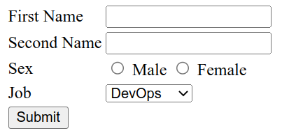

# Readme
This project will help you to set up an Apache server with Python CGI to create HTML form and send information into Python script for further processing. The script supports Cyrillic characters.

<p align="center">

</p>

## Prerequirements

You need a Deb-based installed Linux system and root access.

### First method - Manual

On a clear system run those commands:

```bash
apt update
apt install apache2 python3
a2enmod cgid
service apache2 restart
```

Edit index.html file:

```bash
cd /var/www/html
nano index.html
```

Paste this code and save:

```HTML
<!DOCTYPE html>
<html lang="en">

</html>
<html>

<head>
    <title>Test From</title>
    <meta charset="UTF-8">
</head>

<body>
    <form name=myform method=post action=cgi-bin/data_from_form.py>
        <table>
            <tr>
                <td>First Name </td>
                <td><input type=text name=f_name>
                <td>
            </tr>
            <tr>
                <td>Second Name</td>
                <td> <input type=text name=s_name></td>
            </tr>
            <tr>
                <td>Sex</td>
                <td> <input type=radio name=myradio value=male> Male
                     <input type=radio name=myradio value=female> Female
                </td>
            </tr>
            <tr>
                <td>Job</td>
                <td> <select name=job>
                        <option value='DevOps'>DevOps</option>
                        <option value='Developer'>Developer</option>
                        <option value='Manager'>Manager</option>
                    </select>
                </td>
            </tr>
            <tr>
                <td><input type=submit value=Submit></td>
                <td> </td>
            </tr>
        </table>
    </form>
</body>

</html>
```

Then:

```bash
cd /usr/lib/cgi-bin
nano /usr/lib/cgi-bin/data_from_form.py
```

Paste this code and save:

```python
#!/usr/bin/python3
# -*- coding: UTF-8 -*-
 
# enable debugging
import cgitb
cgitb.enable()
 
import sys
import codecs
import cgi
form = cgi.FieldStorage()
 
sys.stdout = codecs.getwriter("utf-8")(sys.stdout.detach())
 
print("Content-Type: text/html; charset=utf-8")
print()
f_name=form["f_name"].value
s_name=form["s_name"].value
sex=form["myradio"].value
job=form["job"].value


print('<br>First name: ',f_name)
print('<br>Second name: ',s_name)
print('<br>Sex: ',sex)
print('<br>Your job is: ',job)
```

And:

```bash
service apache2 restart
```
Then you can go to your page:

```bash
http://<your IP-address>
```

### Second method - Using Docker compose

On a clear system run this command:

```bash
curl -L https://raw.githubusercontent.com/olamor/HTML_Form-Python_CGI/master/script.sh | bash
```

> **_NOTE:_**  To change port 80 to another just edit docker-compose.yml file HTML_Form-Python_CGI folder.